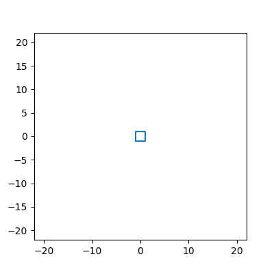

# animatepy, Python animation utilities

## Author

## Usage

Call with

```python
ani = Animatepy()
```

The following modules are supported:

### **animateit**: animate list of plt images

Using `Animatepy.animateit` we can make gif from plt images and display it in Jupyter Notebook. Start with `ani = Animatepy()`, then append images to `ani.img`, and display the movie with `ani.display()`. 


```python
ani = Animatepy(figsize=[4, 4])
N = 20
for i in range(1, N+1):
    im = plt.plot([-i, i, i, -i, -i], [-i, -i, i, i, -i], color='C0')
    ani.img.append(im)
ani.display()
```

which generates the following gif inside a Jupyter Notebook:




The code above is equivalent to the following code:

```python
fig = plt.figure(figsize=[4, 4])
N = 20
imgs = []
for i in range(1, N+1):
    im = plt.plot([-i, i, i, -i, -i], [-i, -i, i, i, -i], color='C0')
    imgs.append(im)
ani = animation.ArtistAnimation(fig, imgs, interval=100, repeat_delay=1000)
plt.close()
HTML(ani.to_html5_video())
```

### **animate_png**: animate a list of local images

TODO